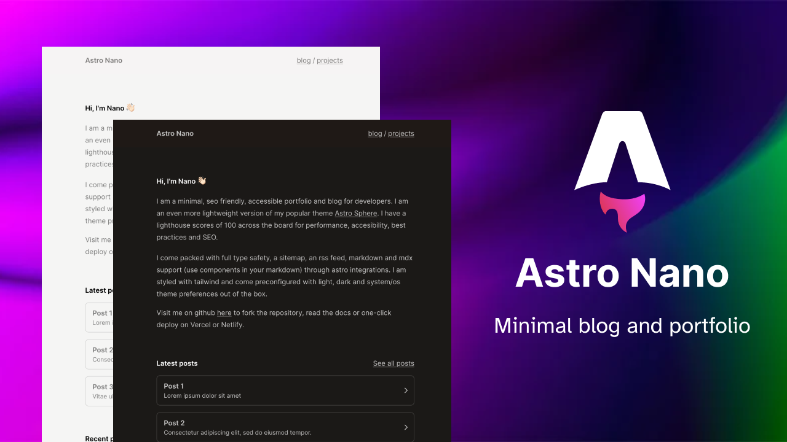

My portfolio and blog

Built with Astro, Tailwind and Typescript.

## Features

- ✅ Responsive
- ✅ Accessible
- ✅ SEO-friendly
- ✅ Minimal style
- ✅ Light/Dark Theme
- ✅ Tailwind styling
- ✅ Auto generated sitemap
- ✅ Auto generated RSS Feed
- ✅ Markdown support
- ✅ MDX Support (components in your markdown)

## Commands

All commands are run from the root of the project, from a terminal:

Make sure you have `pnpm` package manager installed.

| Command                    | Action                                            |
| :------------------------- | :------------------------------------------------ |
| `pnpm install`             | Installs dependencies                             |
| `pnpm run dev`             | Starts local dev server at `localhost:4321`       |
| `pnpm run dev:network`     | Starts local dev server on local network          |
| `pnpm run sync`            | Generates TypeScript types for all Astro modules. |
| `pnpm run build`           | Build your production site to `./dist/`           |
| `pnpm run preview`         | Preview your build locally, before deploying      |
| `pnpm run preview:network` | Preview build on local network                    |
| `pnpm run astro ...`       | Run CLI commands like `astro add`, `astro check`  |
| `pnpm run astro -- --help` | Get help using the Astro CLI                      |
| `pnpm run lint`            | Run ESLint                                        |
| `pnpm run lint:fix`        | Auto-fix ESLint issues                            |

## ️ License

MIT
